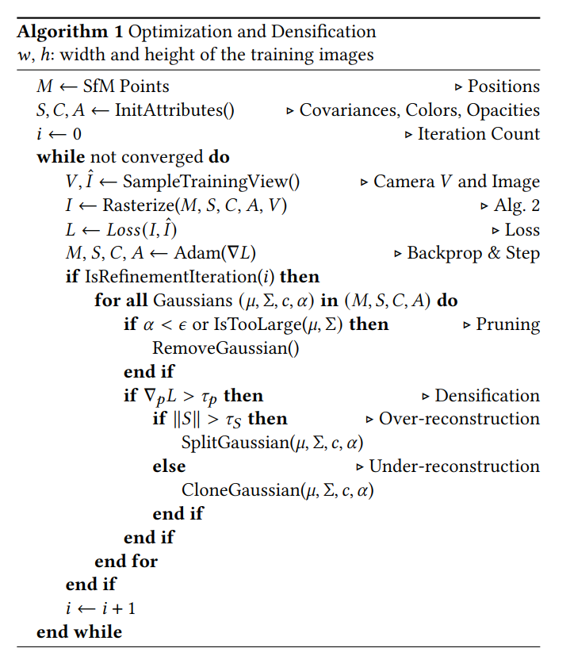
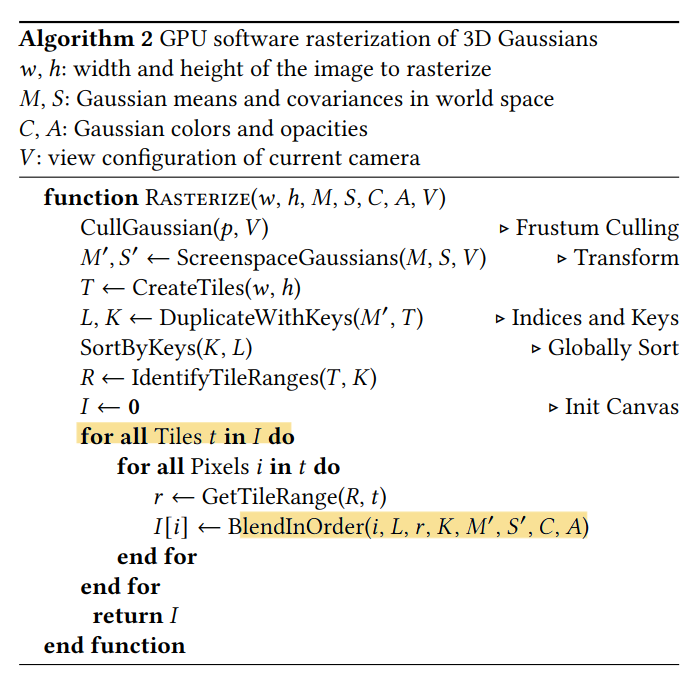

# sploot

Attempting to implement 3d Gaussian Splats from scratch for fun.

## Dataset

Need a dataset with examples to train on. Ideally object-centric, and for each image we need multiple views along with the camera coordinates

### Shapenet Dataset

https://huggingface.co/datasets/ShapeNet/ShapeNetCore

### Spherical Planet Datasets

earth images with camera coordinates?
spherical objects with unique views? easy to verify, relatively small. Does this dataset already exist or is it easy to generate? Can longitude and latitude be used as camera coordinates? longitude and latitude to quaternion?

Google Earth Engine
https://earthengine.google.com/
https://developers.google.com/earth-engine/datasets/catalog/Spain_PNOA_PNOA10
https://developers.google.com/earth-engine/guides/python_install

NASA APIs
https://api.nasa.gov/

You can find orbital data from Nasa here
https://ode.rsl.wustl.edu/mars/productsearch

Conclusion: these datasets are too huge, millions of images and they are reaaaally zoomed in (most seem to have perspective transforms already applied). I need something smaller.

### Algos from original paper

https://repo-sam.inria.fr/fungraph/3d-gaussian-splatting/

